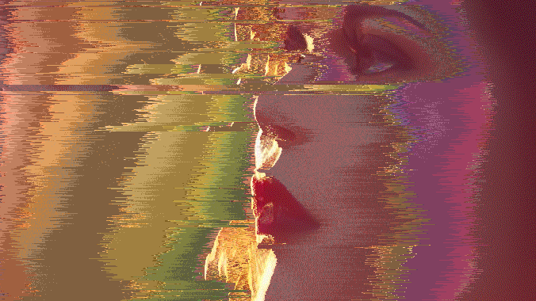

# Pixel sorting made easy
Insipired by [Acerola](https://github.com/GarrettGunnell/Pixel-Sorting)

# What is pixel sorting?
Pixel Sorting is a digital art effect where we apply a sorting algorithm to the pixels of an image and sort them based on certain criteria to create stunning results

# Is it hard?
Pixel sorting can be complicated, but 
You can try this right now on [my website](https://nitaki-dev.github.io/pixel-sorter/)!

# How do I use it?
My pixel sort has a few interesting options:  

Sorting direction, this allows you to choose if you want to sort horizontally or vertically 
Sorting mode, choose HOW the pixels get sorted, either by RGB, Red, Green, Blue, Saturation, Luminence, or my personal favorite Hue  

Masking, this is very useful if you want the image to keep a certain consistency. (you can visualize the mask using the display option) 
For the masking option you can choose the threshold, this gives you more control on the mask  

Finally you have efects, Color Quantization or Dithering.  
-Dithering reduces the colors used and applies a noise to give the illusion of having more colors (this may seem useless but it looks cool) 
-Color Quantization simply reduces the color pallet and keeps it that way, this gives a sharper look to the image. 
